# Harnessing Explanations: LLM-to-LM Interpreter for Enhanced Text-Attributed Graph Representation Learning
[](https://arxiv.org/abs/2305.19523) [](https://paperswithcode.com/sota/node-property-prediction-on-ogbn-arxiv?p=explanations-as-features-llm-based-features)




## Citation
```
@misc{he2023harnessing,
      title={Harnessing Explanations: LLM-to-LM Interpreter for Enhanced Text-Attributed Graph Representation Learning}, 
      author={Xiaoxin He and Xavier Bresson and Thomas Laurent and Adam Perold and Yann LeCun and Bryan Hooi},
      year={2023},
      eprint={2305.19523},
      archivePrefix={arXiv},
      primaryClass={cs.LG}
}
```

## 0. Python environment setup with Conda
```
conda create --name TAPE python=3.8
conda activate TAPE

conda install pytorch==1.12.1 torchvision==0.13.1 torchaudio==0.12.1 cudatoolkit=11.3 -c pytorch
conda install -c pyg pytorch-sparse
conda install -c pyg pytorch-scatter
conda install -c pyg pytorch-cluster
conda install -c pyg pyg
pip install ogb
conda install -c dglteam/label/cu113 dgl
pip install yacs
pip install transformers
pip install --upgrade accelerate
```


## 1. Download TAG datasets

### A. Original text attributes

| Dataset | Description |
| ----- |  ---- |
| ogbn-arxiv  | The [OGB](https://ogb.stanford.edu/docs/nodeprop/) provides the mapping from MAG paper IDs into the raw texts of titles and abstracts. <br/>Download the dataset [here](https://snap.stanford.edu/ogb/data/misc/ogbn_arxiv/titleabs.tsv.gz), unzip and move it to `dataset/ogbn_arxiv_orig`.|
| ogbn-products (subset) |  The dataset is located under `dataset/ogbn_products_orig`.|
| arxiv_2023 |  Download the dataset [here](https://drive.google.com/file/d/1-s1Hf_2koa1DYp_TQvYetAaivK9YDerv/view?usp=sharing), unzip and move it to `dataset/arxiv_2023_orig`.|
|Cora| Download the dataset [here](https://drive.google.com/file/d/1hxE0OPR7VLEHesr48WisynuoNMhXJbpl/view?usp=share_link), unzip and move it to `dataset/cora_orig`.|
PubMed | Download the dataset [here](https://drive.google.com/file/d/1sYZX-jP6H8OkopVa9cp8-KXdEti5ki_W/view?usp=sharing), unzip and move it to `dataset/PubMed_orig`.|


### B. LLM responses
| Dataset | Description |
| ----- |  ---- |
| ogbn-arxiv  | Download the dataset [here](https://drive.google.com/file/d/1A6mZSFzDIhJU795497R6mAAM2Y9qutI5/view?usp=sharing), unzip and move it to `gpt_responses/ogbn-arxiv`.|
| ogbn-products (subset)  | Download the dataset [here](https://drive.google.com/file/d/1C769tlhd8pT0s7I3vXIEUI-PK7A4BB1p/view?usp=sharing), unzip and move it to `gpt_responses/ogbn-products`.|
| arxiv_2023 | Download the dataset [here](https://www.dropbox.com/scl/fi/cpy9m3mu6jasxr18scsoc/arxiv_2023.zip?rlkey=4wwgw1pgtrl8fo308v7zpyk59&dl=0), unzip and move it to `gpt_responses/arxiv_2023`.|
|Cora| Download the dataset [here](https://drive.google.com/file/d/1tSepgcztiNNth4kkSR-jyGkNnN7QDYax/view?usp=sharing), unzip and move it to `gpt_responses/cora`.|
PubMed | Download the dataset [here](https://drive.google.com/file/d/166waPAjUwu7EWEvMJ0heflfp0-4EvrZS/view?usp=sharing), unzip and move it to `gpt_responses/PubMed`.|


## 2. Fine-tuning the LMs
### To use the orginal text attributes
```
WANDB_DISABLED=True TOKENIZERS_PARALLELISM=False CUDA_VISIBLE_DEVICES=0,1,2,3 python -m core.trainLM dataset ogbn-arxiv
```

### To use the GPT responses
```
WANDB_DISABLED=True TOKENIZERS_PARALLELISM=False CUDA_VISIBLE_DEVICES=0,1,2,3 python -m core.trainLM dataset ogbn-arxiv lm.train.use_gpt True
```


## 3. Training the GNNs

### To use different GNN models
```
python -m core.trainEnsemble gnn.model.name MLP
python -m core.trainEnsemble gnn.model.name GCN
python -m core.trainEnsemble gnn.model.name SAGE
python -m core.trainEnsemble gnn.model.name RevGAT gnn.train.lr 0.002 gnn.train.dropout 0.75
```

### To use different types of features
```
# Our enriched features
python -m core.trainEnsemble gnn.train.feature_type TA_P_E

# Our individual features
python -m core.trainGNN gnn.train.feature_type TA
python -m core.trainGNN gnn.train.feature_type E
python -m core.trainGNN gnn.train.feature_type P

# OGB features
python -m core.trainGNN gnn.train.feature_type ogb
```


## 4. Reproducibility
Use `run.sh` to run the codes and reproduce the published results.

This repository also provides the checkpoints for all trained models `(*.ckpt)` and the TAPE features `(*.emb)` used in the project. Please donwload them [here](https://drive.google.com/drive/folders/1nF8NDGObIqU0kCkzVaisWooGEQlcNSIN?usp=sharing).

### arxiv-2023 dataset
The codes for constructing and processing the `arxiv-2023` dataset are provided [here](https://github.com/XiaoxinHe/arxiv_2023).
